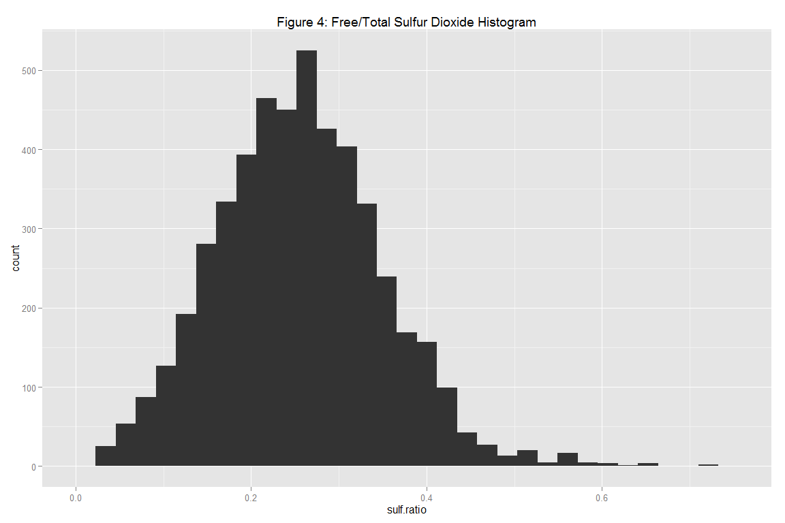
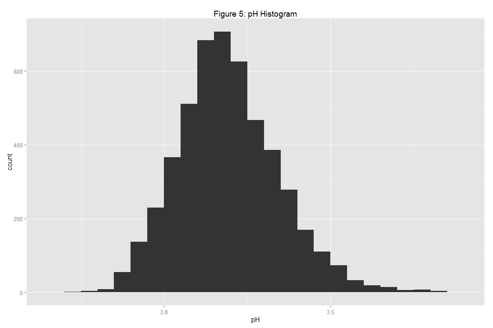
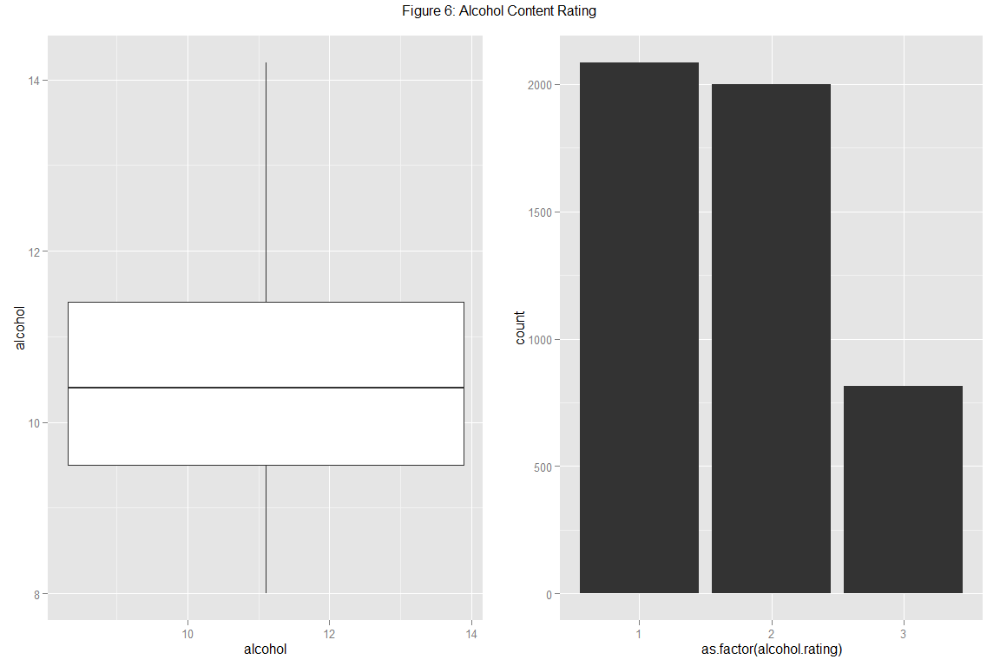
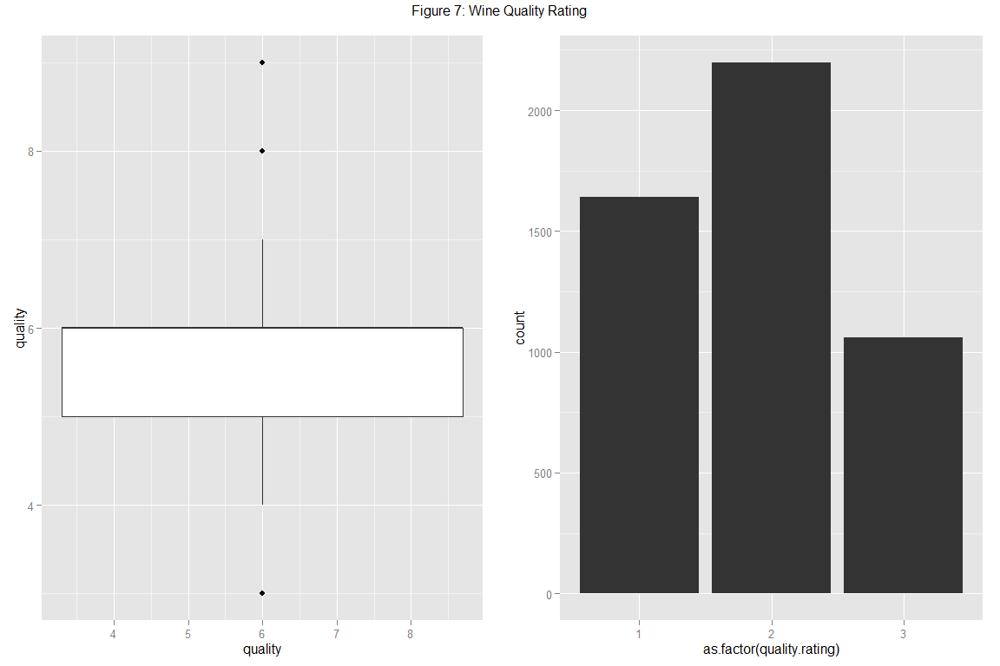
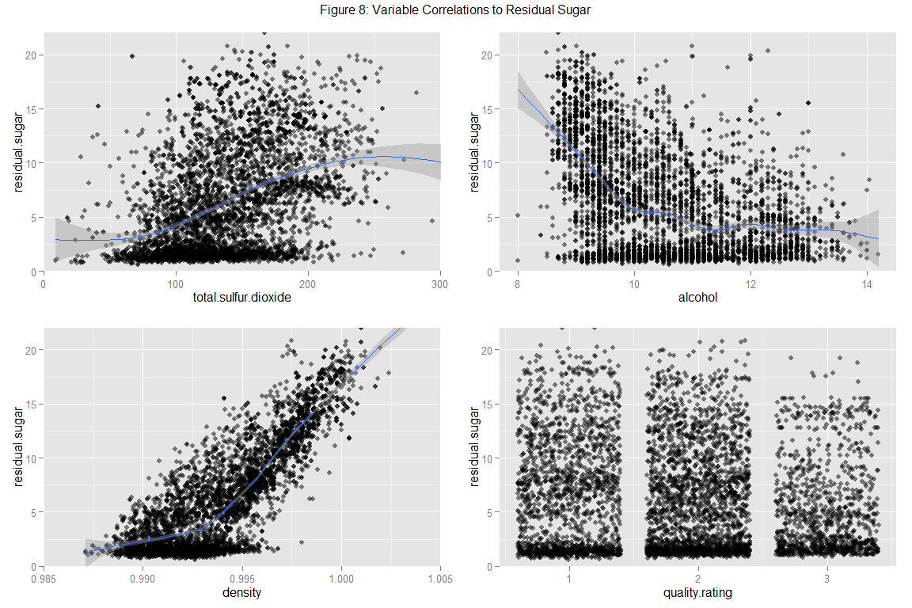
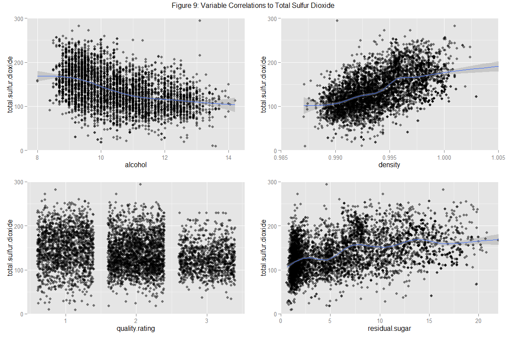
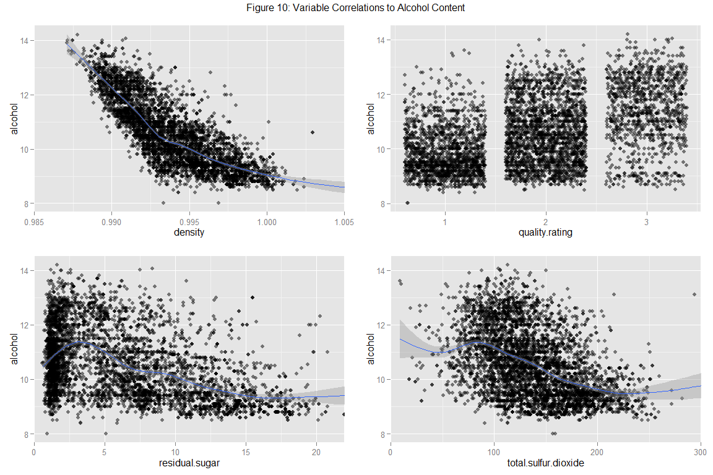
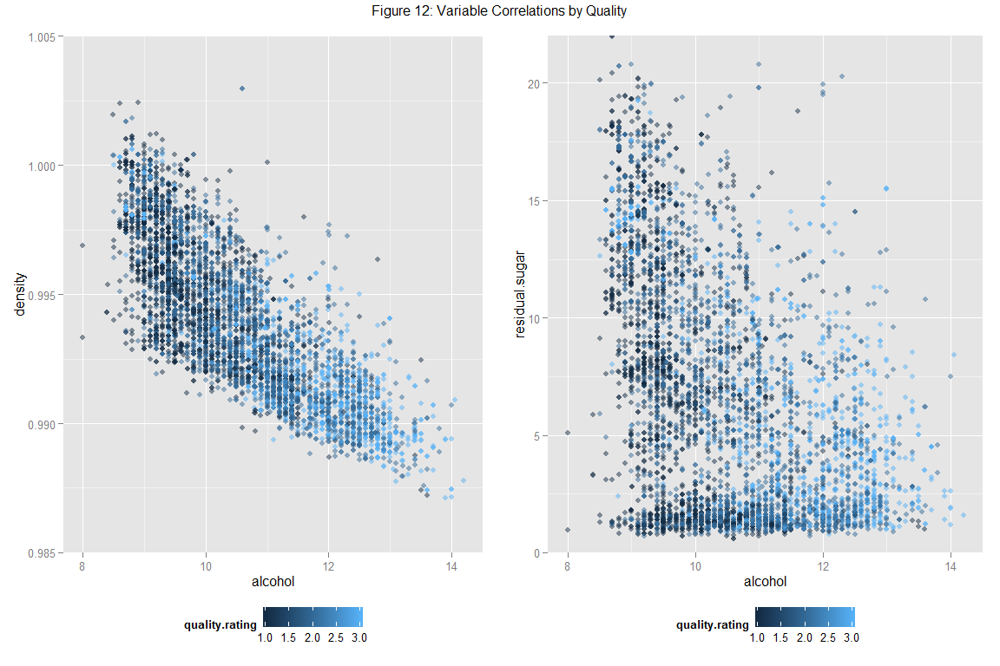
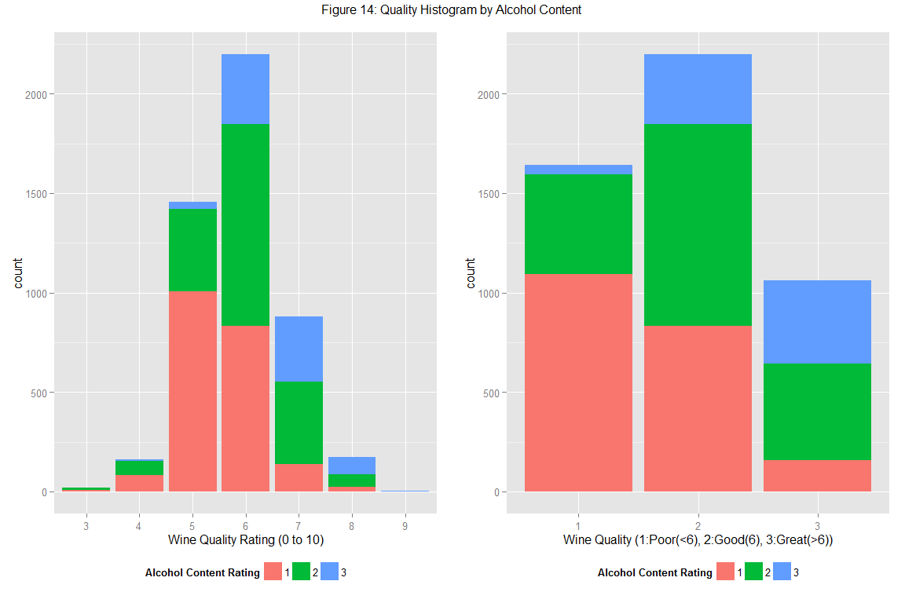
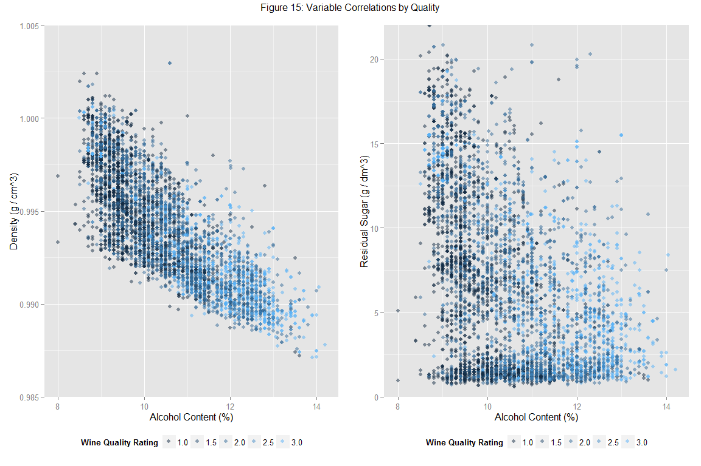

#Explore and Summarize Data
###Project: ND_Project4


###Introduction
This repository holds results for the Udacity Nanodegree Project: Explore and Summarize Data. For this project, I selected the 'White Wine Quality' dataset and exercised  Exploratory Data Analysis techniques in order to investigate property relationships.


###Data
The dataset contains information on 11 chemical and physical properties for 4,898 white wines. Also included in the data set is a quality ranking and an explicit ID.

The dataset was obtained from: [Dataset link](https://s3.amazonaws.com/udacity-hosted-downloads/ud651/wineQualityReds.csv)

Chemical Prperties:

* fixed acidity: most acids involved with wine or fixed or nonvolatile (do not evaporate readily) (tartaric acid - g / dm^3)
* volatile acidity: the amount of acetic acid in wine, which at too high of levels can lead to an unpleasant, vinegar taste (acetic acid - g / dm^3)
* citric acid: found in small quantities, citric acid can add 'freshness' and flavor to wines (g / dm^3)
* residual sugar: the amount of sugar remaining after fermentation stops (g / dm^3)
* chlorides: the amount of salt in the wine (sodium chloride - g / dm^3
* free sulfur dioxide: he free form of SO2 exists in equilibrium between molecular SO2 (as a dissolved gas) and bisulfite ion (mg / dm^3)
* total sulfur dioxide: amount of free and bound forms of S02 (mg / dm^3)
* density: the density of water is close to that of water depending on the percent alcohol and sugar content (g / cm^3)
* pH: describes how acidic or basic a wine is on a scale from 0 (very acidic) to 14 (very basic)
* sulphates: a wine additive which can contribute to sulfur dioxide gas (S02) levels (potassium sulphate - g / dm3)
* alcohol: the percent alcohol content of the wine (% by volume)

Output variable (based on sensory data):

* Quality (score of wine between 0 and 10)


###1. Loading Packages/ Data


```r
##dim(data_wine.raw)
str(data_wine.raw)
```

```
## 'data.frame':	4898 obs. of  13 variables:
##  $ X                   : int  1 2 3 4 5 6 7 8 9 10 ...
##  $ fixed.acidity       : num  7 6.3 8.1 7.2 7.2 8.1 6.2 7 6.3 8.1 ...
##  $ volatile.acidity    : num  0.27 0.3 0.28 0.23 0.23 0.28 0.32 0.27 0.3 0.22 ...
##  $ citric.acid         : num  0.36 0.34 0.4 0.32 0.32 0.4 0.16 0.36 0.34 0.43 ...
##  $ residual.sugar      : num  20.7 1.6 6.9 8.5 8.5 6.9 7 20.7 1.6 1.5 ...
##  $ chlorides           : num  0.045 0.049 0.05 0.058 0.058 0.05 0.045 0.045 0.049 0.044 ...
##  $ free.sulfur.dioxide : num  45 14 30 47 47 30 30 45 14 28 ...
##  $ total.sulfur.dioxide: num  170 132 97 186 186 97 136 170 132 129 ...
##  $ density             : num  1.001 0.994 0.995 0.996 0.996 ...
##  $ pH                  : num  3 3.3 3.26 3.19 3.19 3.26 3.18 3 3.3 3.22 ...
##  $ sulphates           : num  0.45 0.49 0.44 0.4 0.4 0.44 0.47 0.45 0.49 0.45 ...
##  $ alcohol             : num  8.8 9.5 10.1 9.9 9.9 10.1 9.6 8.8 9.5 11 ...
##  $ quality             : int  6 6 6 6 6 6 6 6 6 6 ...
```

```r
##summary(data_wine.raw)
```

###2. Pre-process the Data
Create a new series which shows the ratio of free sulfur dioxide to total sulfur dioxide.


```r
summary(data_wine$sulf.ratio)
```

```
##    Min. 1st Qu.  Median    Mean 3rd Qu.    Max. 
## 0.02362 0.19090 0.25370 0.25560 0.31580 0.71050
```

Bucket wine quality score into three new categories: 1:Poor (5 score or less), 2:Good (6 score), 3:Great (7 score or greater).


```r
summary(data_wine$quality.rating)
```

```
##    Min. 1st Qu.  Median    Mean 3rd Qu.    Max. 
##   1.000   1.000   2.000   1.882   2.000   3.000
```

Bucket wine alcohol content into three new categories: 1:Light (9% or less), 2:Mild (between 10% and 12%), 3:Strong (12% or greater).


```r
summary(data_wine$alcohol.rating)
```

```
##    Min. 1st Qu.  Median    Mean 3rd Qu.    Max. 
##    1.00    1.00    2.00    1.74    2.00    3.00
```


###3. Univariate Analysis
Univariate analysis is intended to provide insights of absolute levels of individual series within the dataset.

The below shows histograms for all original dataset variables.
 
The majority of variables are approximately normally distributed and many have a positive skew. Judging by the automatically adjusted scale on each distribution, it seems there are also a small number of outliers within some variables.

The below shows a histogram and summary metrics for total sulfur dioxide.
 

```
##    Min. 1st Qu.  Median    Mean 3rd Qu.    Max. 
##     9.0   108.0   134.0   138.4   167.0   440.0
```
The min free sulfur dioxide value is 9.0 mg/dm^3, the max is 440.0 mg/dm^3. As per the comment made above, it seems the 440 mg/dm^3 is an outlier.

The below shows a histogram and summary metrics exluding observations where free sulfure dioxide is greater than 300 mg/dm^3.
 

```
##    Min. 1st Qu.  Median    Mean 3rd Qu.    Max. 
##     9.0   108.0   134.0   138.1   167.0   294.0
```

Each wine has both a free sulfur dioxide count and total sulfur dioxide count. The below shows a histogram and summary metrics for the ratio of the two.
 

```
##    Min. 1st Qu.  Median    Mean 3rd Qu.    Max. 
## 0.02362 0.19090 0.25370 0.25560 0.31580 0.71050
```
Note that using a summary metric such as the one above provides another method of accounting for the extreme free/total sulfur dioxide outliers.

The below shows a histogram and summary metrics for wine pH.
 

```
##    Min. 1st Qu.  Median    Mean 3rd Qu.    Max. 
##   2.720   3.090   3.180   3.188   3.280   3.820
```
Based on recorded pH levels, it seems the tested wines are acidic (pH < 7) falling within the range of 2.7 pH to 3.8 pH.

The below shows a histogram and summary metrics for wine alcohol content.
 

```
##    Min. 1st Qu.  Median    Mean 3rd Qu.    Max. 
##    8.00    9.50   10.40   10.51   11.40   14.20
```
It seems higher alcohol content wines (> 12%) are less common than lower alcohol content wines.

The below shows a histogram and summary metrics for the wine quality ratings.
 

```
##    Min. 1st Qu.  Median    Mean 3rd Qu.    Max. 
##   3.000   5.000   6.000   5.878   6.000   9.000
```
For most wines, the quality score falls between 5 and 7. There are a few exceptions of wines with scores of 8 or above, and of 4 or below.

Q: What is the structure of your dataset?
The raw dataset has 12 columns representing various wine properties and 4,898 rows each representing recorded observations. The majority of variables are quantitative measurements of a chemical or physical property. One variable is a subjective labeling of the quality of wine taste.

Q: What is/are the main feature(s) of interest in your dataset?
As a first pass, the main feature of interest seems to be the wine quality, and whether the data supports a relationship between perceived quality and any/all of the recorded chemical properties.

Q: What other features in the dataset do you think will help support your investigation into your feature(s) of interest?
At this stage, it is difficult to rule out any relationships butI suspect sulphur content, acidity, pH and alcohol content will have a relationship with perceived quality.

Q: Did you create any new variables from existing variables in the dataset?
Yes, a variable which shows the ratio of free sulfur dioxide to total sulfur dioxide and a variable which recategorizes wine quality ratings.

Q: Of the features you investigated, were there any unusual distributions? Did you perform any operations on the data to tidy, adjust, or change the form of the data? If so, why did you do this?
The majority of variables are approximately normally distributed, however many have a positive skew. There also seems to be a number of outliers within each of the dataset variables. No data transformations have been performed at this stage as the intention at this stage is to limit axis ranges for plots in order to account for outliers within each visual representation.


###4. Bivariate Analysis
Bivariate analysis is intended to provide insights of the relationship between any pair of variables within the dataset.

The below shows a correlation matrix between each of the original dataset variables.

```
##       A     B     C     D     E     F     G     H     I     J     K     L
## A  1.00 -0.26  0.00 -0.15  0.01 -0.05 -0.01 -0.16 -0.19 -0.12  0.01  0.21
## B -0.26  1.00 -0.02  0.29  0.09  0.02 -0.05  0.09  0.27 -0.43 -0.02 -0.12
## C  0.00 -0.02  1.00 -0.15  0.06  0.07 -0.10  0.09  0.03 -0.03 -0.04  0.07
## D -0.15  0.29 -0.15  1.00  0.09  0.11  0.09  0.12  0.15 -0.16  0.06 -0.08
## E  0.01  0.09  0.06  0.09  1.00  0.09  0.30  0.40  0.84 -0.19 -0.03 -0.45
## F -0.05  0.02  0.07  0.11  0.09  1.00  0.10  0.20  0.26 -0.09  0.02 -0.36
## G -0.01 -0.05 -0.10  0.09  0.30  0.10  1.00  0.62  0.29  0.00  0.06 -0.25
## H -0.16  0.09  0.09  0.12  0.40  0.20  0.62  1.00  0.53  0.00  0.13 -0.45
## I -0.19  0.27  0.03  0.15  0.84  0.26  0.29  0.53  1.00 -0.09  0.07 -0.78
## J -0.12 -0.43 -0.03 -0.16 -0.19 -0.09  0.00  0.00 -0.09  1.00  0.16  0.12
## K  0.01 -0.02 -0.04  0.06 -0.03  0.02  0.06  0.13  0.07  0.16  1.00 -0.02
## L  0.21 -0.12  0.07 -0.08 -0.45 -0.36 -0.25 -0.45 -0.78  0.12 -0.02  1.00
## M  0.04 -0.11 -0.19 -0.01 -0.10 -0.21  0.01 -0.17 -0.31  0.10  0.05  0.44
##       M
## A  0.04
## B -0.11
## C -0.19
## D -0.01
## E -0.10
## F -0.21
## G  0.01
## H -0.17
## I -0.31
## J  0.10
## K  0.05
## L  0.44
## M  1.00
```

```
##       [,1]                   [,2]
##  [1,] "X"                    "A" 
##  [2,] "fixed.acidity"        "B" 
##  [3,] "volatile.acidity"     "C" 
##  [4,] "citric.acid"          "D" 
##  [5,] "residual.sugar"       "E" 
##  [6,] "chlorides"            "F" 
##  [7,] "free.sulfur.dioxide"  "G" 
##  [8,] "total.sulfur.dioxide" "H" 
##  [9,] "density"              "I" 
## [10,] "pH"                   "J" 
## [11,] "sulphates"            "K" 
## [12,] "alcohol"              "L" 
## [13,] "quality"              "M"
```

The strongest correlations between the dataset variables are between:

* Correl1: I:density and E:residual sugar
* Correl2: I:density and H:total sulfur dioxide
* Correl3: I:density and L:alcohol
* Correl4: H:total sulfur dioxide and G:free sulfur dioxide

Correlation 4 is intuitive as these dataset variables are derivations of the other. Correlations 1, 2 and 3 are of interest however, and warrant further investigation. In the following plots, we will focus on the relationships between residual sugar, total sulfur dioxide, alcohol, density and wine quality rating.

Scatterplots of correlations between the variables of interest and residual sugar are shown below.
 
There is a positive relationship between residual sugar and total sulfur dioxide/density and a negative relationship between residual sugar and alcohol. It seems that the negative relationship between residual sugar and alcohol is strongest in wines with a low alcohol content (< ~10%). While the strong positive relationship between residual sugar and density is less strong for low residual sugar levels (< ~5 g/dm^3).

Scatterplots of correlations between the variables of interest and total sulfur dioxide are shown below.
 
Both the negative correlation between total sulfur dioxide and alcohol as well as the positive correlation between total sulfur dioxide and density are confirmed in the scatterplots above. Interestingly the linear relationship between total sulfur dioxide and density seems to have a 'step' at a density level (~0.9995 g/cm^3).

Scatterplots of correlations between the variables of interest and alcohol are shown below.
 
Again, the strong negative correlation between alcohol and density is immediately obvious. Interestingly, there also seems to be a positive correlation between alcohol and perceived wine quality. We investigate this further below.

Histograms of wine quality ratings by alcohol content are shown below.
 
Higher alcohol content wines: 2:Mild (between 10% and 12%), 3:Strong (12% or greater) are more represented by higher wine quality ratings.

Q: Talk about some of the relationships you observed in this part of the investigation. How did the feature(s) of interest vary with other features in the dataset?
The key relationship is between the main feature of interest (wine quality) and alcohol. In general, as the level of alcohol increases (decreases), the perceived quality of the wine improves.

Q: Did you observe any interesting relationships between the other features (not the main feature(s) of interest)?
* A lower (higher) amount of residual sugars and/or density in a given wine will tend to bring with it a lower (higher) amount of sulfur dioxide.
* A lower (higher) amount of residual sugars and/or density in a given wine will tend to bring with it a higher (lower) amount of alcohol. This relationship is strongest for those wines which have a relatively high sugar level.

Q: What was the strongest relationship you found?
The strongest correlation found was between density and residual sugar. Again, this relationship is strongest for wines with a high sugar level.


###5. Multivariate Analysis
Multivariate analysis is intended to provide insights of the relationship between any three or more variables within the dataset.

Wine quality has a relationship with alcohol and an implied relationship with density and residual sugar. In order to visually respresent these relationships, we create scatterplots of alcohol, density and residual sugar whereby the scatter is colored by the quality rating.
 
Once again, the postive correlation between alcohol content and wine quality as well as the negative correlation between density and residual sugar are observed. However, it is difficult to see any relationship between density or residual sugar and level of percieved wine quality.

Q: Talk about some of the relationships you observed in this part of the investigation. How did the feature(s) of interest vary with other features in the dataset?
We established a relationship between alcohol and wine quality as part of the bivariate analysis. As part of the multivariate analysis, effort was put towards establishing whether those factors which have an identified correlation with alcohol (density and residual sugar), would also demonstrate a relationship with wine quality. Unfortunately, there is no obvious relationship between wine quality and these factors.

Q: Did you observe any interesting relationships between the other features (not the main feature(s) of interest)?
The negative correlation between alcohol and density once again presented itself as part of the multivariate analysis.


###6. Final Plots and Summary
A summary of the key univariate, bivariate and multivariate plots.

Revisting the distribution of wine quality ratings, we see that for most wines, the quality score falls between 5 and 7.
 

As part of the bivariate analysis, a relationship between alcohol and wine quality was found.
 
Higher alcohol content wines: 2:Mild (between 10% and 12%), 3:Strong (12% or greater) are more represented by higher wine quality ratings.

Although a relationship exists between alcohol and density/residual sugar, these alternative chemical properties show no noticeable relationship to wine quality.
 


###Reflection
* I found a number of outliers within this dataset. Since this analysis focused on visual representation of data rather than statistical inference, I accounted for these outliers by manually setting plot ranges.

* I initially struggled to see what insights could be gained from this dataset. However, going through each variable systematically as part of the univariate/bivariate analysis helped to narrow in the key data drivers/relationships.

* It does not look like wine quality is well supported by the majority of chemical properties. Although there is a relationship between alcohol content and quality, I struggled to find similar relationships between quality and other chemical variables.
